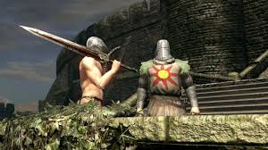
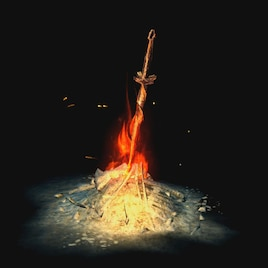

# Dark Souls

Wejdź do krainy Lordran, gdzie niebezpieczeństwo czyha za każdym rogiem, a odwaga jest wystawiana na próbę na każdym kroku. Przygotuj się na śmierć... i powstań ponownie. To świat inny niż wszystkie — mroczny, wymagający i głęboko satysfakcjonujący.

---

## Historia Dark Souls: Ponadczasowa Opowieść

Dark Souls opowiada historię wybrańca, który ma za zadanie przerwać cykl światła i ciemności. Gra zachęca do odkrywania jej enigmatycznej fabuły poprzez tajemniczych NPC-ów, subtelne opowiadanie historii za pomocą otoczenia i bogatą lore ukrytą w opisach przedmiotów. Każdy krok odkrywa starożytne sekrety Lordran.

## Walka: Taniec ze Śmiercią

Walka w Dark Souls to przemyślane i metodyczne doświadczenie. Każde uderzenie, blok i unik muszą być dokładnie wyczute. Błędy są surowo karane, a zwycięstwo zdobywa się dzięki wytrwałości. Niezależnie od tego, czy posługujesz się ogromnym mieczem, czy precyzyjnym rapierem, system walki nagradza umiejętności i kreatywność.

  

## Świat Lordran: Piękno w Mroku

Lordran to mistrzowsko zaprojektowany świat. Od złotych wież Anor Londo po klaustrofobiczne głębiny Blighttown — każda lokacja jest ze sobą połączona i pełna celu. Bezszwowy projekt poziomów oferuje zarówno wyzwania, jak i zachwyt, zachęcając do eksploracji.

## Multiplayer: Sojusznicy i Przeciwnicy

Multiplayer w Dark Souls jest równie unikalny, co tryb dla jednego gracza. Możesz przyzwać innych graczy do pomocy, najeżdżać światy jako czerwony duch, aby sprawdzić swoje umiejętności, lub zostawiać tajemnicze wiadomości, które mogą pomóc — lub zaszkodzić — innym poszukiwaczom przygód. Multiplayer łączy współpracę i rywalizację.

  

## Dziedzictwo Niepodobne do Innych

Dark Souls pozostawiło niezatarte piętno na świecie gier. Jego wymagający, lecz sprawiedliwy design, klimatyczne opowiadanie historii i innowacyjny multiplayer wpłynęły na niezliczone tytuły. Gatunek "Soulsborne" stał się klasykiem, uwielbianym przez graczy na całym świecie.

---

## Przydatne Zasoby o Dark Souls

- [Oficjalna Wiki Dark Souls](https://darksouls.wiki.fextralife.com): Przewodnik po broniach, lore i strategiach.
- [Subreddit Dark Souls](https://www.reddit.com/r/darksouls/): Społeczność graczy dzielących się poradami, fanartami i historiami.

---

## Kluczowe Cechy Dark Souls

| **Cecha**          | **Opis**                                     |
|---------------------|----------------------------------------------|
| **Data premiery**   | 22 września 2011 (Japonia)                  |
| **Producent**       | FromSoftware                                |
| **Wydawca**         | Bandai Namco Entertainment                  |
| **Tryby gry**       | Single-player, multiplayer                  |
| **Platformy**       | PC, PlayStation, Xbox, Nintendo Switch      |

---
