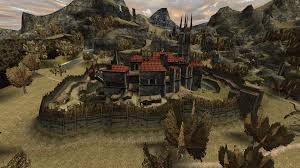
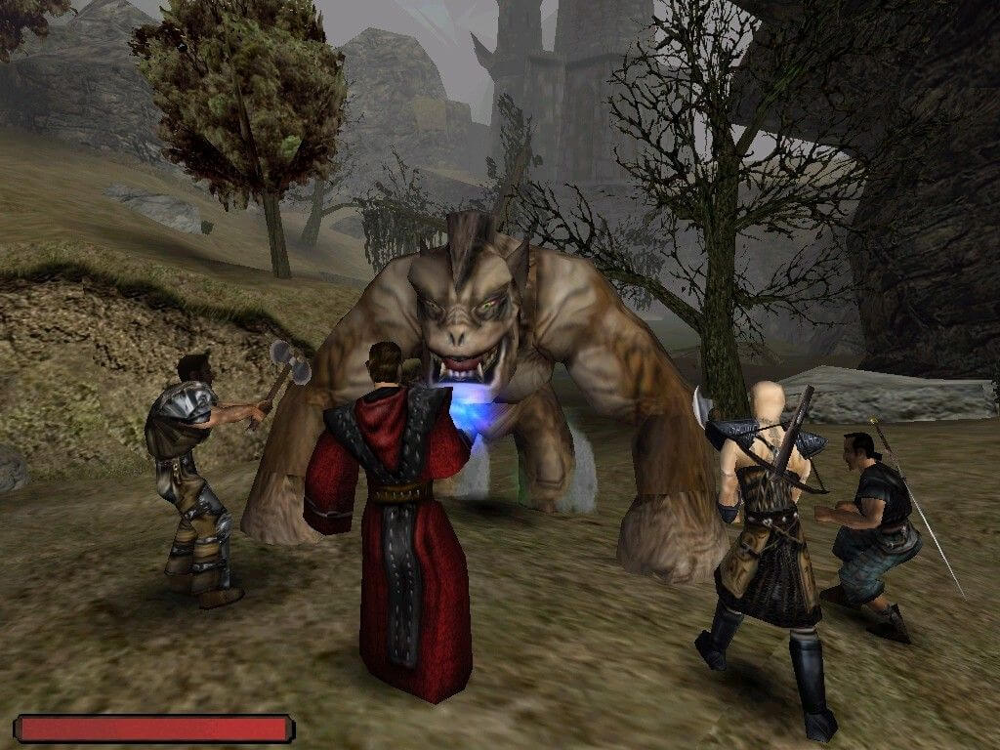

# Witaj w Świecie Gothic

Wejdź do mrocznego i bezlitosnego świata **Gothic** – serii RPG znanej z niezwykłej atmosfery, wciągającej fabuły i wymagającej rozgrywki. Odkrywaj gęste lasy, starożytne ruiny i tętniące życiem obozy w grze, która oferuje niezapomniane doświadczenie.

---

## Opowieść o Buncie i Odkupieniu

W serii Gothic wcielasz się w Bezimiennego Bohatera, skazańca wrzuconego do magicznej bariery otaczającej kolonię karną. Twoim zadaniem jest nawigowanie pomiędzy sojuszami, wykonywanie misji i walka z potężnymi przeciwnikami, by z więźnia stać się wybawcą — lub zdobywcą. Fabuła Gothic jest pełna głębi, a podejmowane decyzje mają realny wpływ na świat gry.

## Rozgrywka: Wolność z Konsekwencjami

Gothic oferuje niespotykaną swobodę działania, pozwalając wykuwać własną ścieżkę. Dołącz do frakcji takich jak Stary Obóz, Nowy Obóz czy Bractwo Śniącego, z których każda oferuje unikalne historie i korzyści. System walki i rozwoju postaci nagradza strategię oraz eksplorację, a NPC-e reagują dynamicznie na twoje działania.

  

## Świat: Imersyjny i Połączony

Światy Gothic są starannie zaprojektowane, pełne życia i tajemnic. Każdy obszar, od mrocznych lasów i skalistych klifów po tętniące życiem obozy, jest ze sobą powiązany. Dzikie zwierzęta i NPC-e zachowują się naturalnie, tworząc immersyjne doświadczenie, w którym każda część mapy skrywa coś wartego odkrycia.

## Żyjąca Społeczność

NPC-e w Gothic mają codzienne rutyny, co sprawia, że świat gry wydaje się żywy. Kupcy, myśliwi i strażnicy pełnią określone funkcje, tworząc wiarygodny ekosystem. Interakcje z nimi są kluczowe — mogą otworzyć drzwi lub zamknąć je na zawsze. Szczegółowość systemów społecznych wyróżnia Gothic na tle innych gier RPG.

  

## Dziedzictwo Gothic

Od swojej premiery w 2001 roku Gothic wpłynął na wiele innych gier RPG, dzięki swojej immersyjnej konstrukcji świata i swobodzie działania. Lojalna społeczność fanów utrzymuje serię przy życiu poprzez modyfikacje, remake’i i projekty fanowskie. Niezależnie od tego, czy jesteś weteranem, czy nowicjuszem, świat Gothic warto odkryć.

---

## Przydatne Zasoby o Gothic

- [Oficjalna Wiki Gothic](https://gothic.fandom.com): Poznaj szczegóły fabuły, postaci i frakcji z serii Gothic.  
- [Strona Gothic na Steam](https://store.steampowered.com/app/65540/Gothic/): Kup Gothic i rozpocznij przygodę.

---

## Kluczowe Cechy Gothic

| **Cecha**          | **Opis**                                     |
|---------------------|----------------------------------------------|
| **Data premiery**   | 15 marca 2001                               |
| **Producent**       | Piranha Bytes                               |
| **Wydawca**         | JoWooD Productions                          |
| **Tryby gry**       | Single-player                               |
| **Platformy**       | PC                                          |

---
